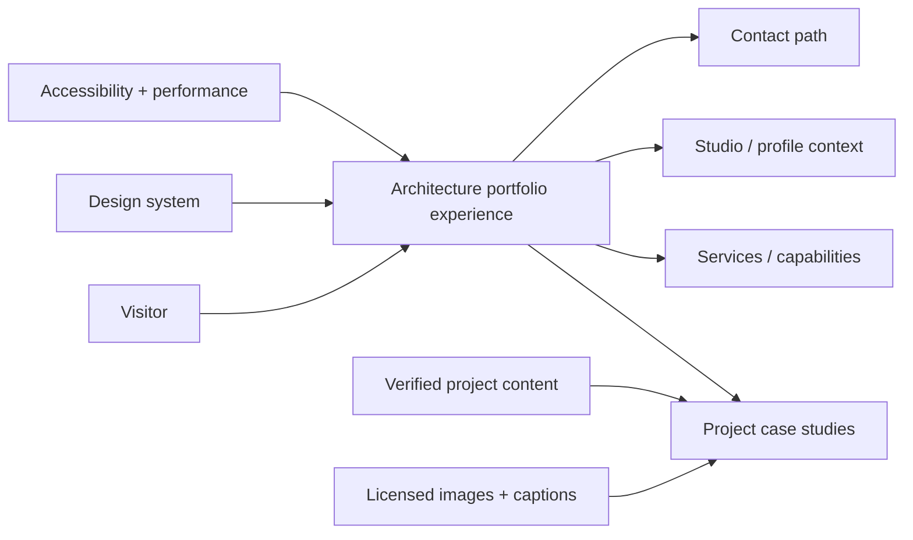
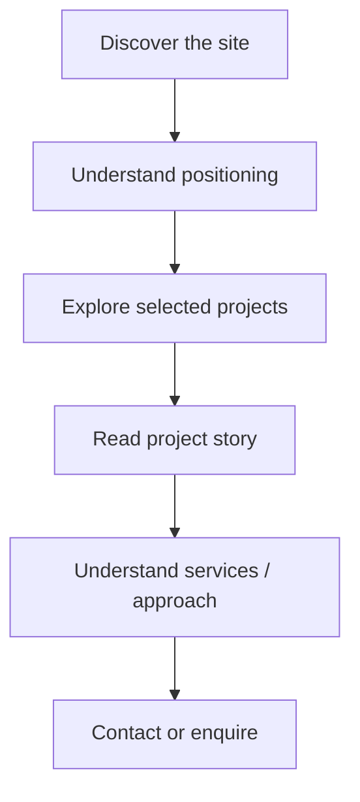
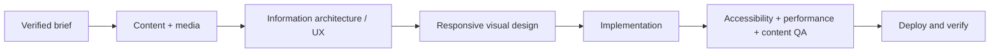

<div align="center">

# 🏛️ Architecture Website

**A planning and design repository for a future architecture and interior-design portfolio website, focused on project storytelling, visual hierarchy, accessibility, performance, and maintainable implementation.**


[Project brief](./docs/PROJECT_AND_DESIGN_BRIEF.md) · [Detailed docs](./docs/README.md) · [Issues](https://github.com/Nischhalsubba/Architecture-Website/issues)

</div>

## Overview

Architecture Website is currently a **product, content, and design planning repository**, not a deployed application. It defines how a future architecture or interior-design portfolio should communicate projects, services, process, decisions, and outcomes without inventing clients, metrics, awards, or delivery claims.

| Audience | What to look for |
|---|---|
| Designers | Visual hierarchy, project storytelling, imagery, motion and responsive behavior |
| Developers | Future implementation boundaries, performance, accessibility and maintainability |
| Content teams | Case-study structure, captions, credits, service copy and metadata |
| Stakeholders | Product intent, user journey, release expectations and verification standards |

<details open>
<summary><strong>🏗️ Interactive architecture plan</strong></summary>



</details>

## Product flow



## Current repository structure

```text
Architecture-Website/
├── docs/
│   ├── assets/
│   ├── PROJECT_AND_DESIGN_BRIEF.md
│   └── README.md
├── LICENSE
└── README.md
```

There is currently no package manifest, runtime, build system, or deployment configuration. Add implementation commands only when real application code exists.

## Design and implementation principles

- Let project work carry the visual emphasis instead of decorative UI effects.
- Use semantic structure, logical headings, visible focus states and keyboard-accessible controls.
- Preserve image dimensions, ownership, credits and meaningful alternative text.
- Support reduced motion and avoid scroll hijacking or unnecessary parallax.
- Keep content, layout, presentation and metadata responsibilities clear.
- Introduce a CMS only when a real editing workflow justifies one.

## SEO and discoverability

When the website is implemented, use accurate, human-readable language around topics such as **architecture portfolio, interior design portfolio, architectural projects, design process, project case studies, studio services, and architectural design work**. Pair that with unique page titles, useful meta descriptions, semantic headings, descriptive image text, canonical URLs, social-preview metadata and structured data only where the content genuinely supports it.

## Delivery flow



## Documentation

The detailed planning source remains in [`docs/PROJECT_AND_DESIGN_BRIEF.md`](./docs/PROJECT_AND_DESIGN_BRIEF.md), with additional repository guidance in [`docs/README.md`](./docs/README.md).
