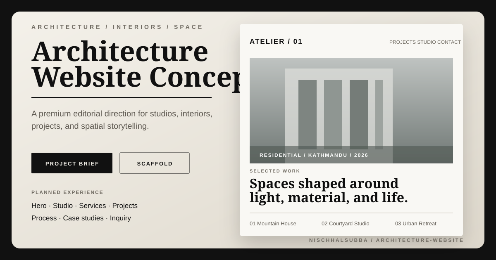

<div align="center">



# Architecture Website

### Product and design scaffold for a premium architecture or interior-design studio website

A documentation-first repository defining the product direction, information architecture, visual language, content model, accessibility standards, technical options, and launch plan for a future architecture website.


[Project and design brief](./docs/PROJECT_AND_DESIGN_BRIEF.md) · [Repository instructions](./AGENTS.md)

</div>

## Current status

This repository is a **planning and design scaffold**, not a completed website.

It currently contains:

- a branded concept thumbnail
- product and audience definition
- proposed information architecture
- homepage and project-page requirements
- visual and motion direction
- content-model recommendations
- accessibility and performance requirements
- implementation options
- testing and launch checklists

It does **not** currently contain:

- application source code
- `package.json` or lockfile
- build or development scripts
- automated tests
- CI configuration
- deployment
- verified browser screenshots

That distinction is intentional. A polished README should improve clarity, not perform necromancy on files that do not exist.

## Product direction

The proposed product is a premium architecture or interior-design studio website that helps prospective clients:

1. understand the studio's positioning
2. explore selected projects
3. evaluate services and process
4. review project context and design decisions
5. make a qualified enquiry

The experience should be image-led, editorial, restrained, and readable, with project storytelling doing more work than decorative animation.

## Intended audiences

### Primary

- residential clients
- commercial clients
- developers and property owners
- collaborators and consultants
- design-conscious prospects

### Secondary

- future team members
- press and award reviewers
- students and researchers
- suppliers and project partners

## Proposed information architecture

```text
/
├── /projects
│   └── /projects/[slug]
├── /studio
├── /services
├── /process
├── /journal
│   └── /journal/[slug]
├── /contact
├── /privacy
└── /404
```

A smaller first release can combine Studio, Services, and Process on the homepage while keeping dedicated project-detail pages.

## Recommended homepage sections

| Section | Purpose |
|---|---|
| Header | Minimal navigation and clear studio identity |
| Hero | Strong visual introduction and concise positioning |
| Selected projects | Project credibility through image-led work |
| Studio statement | Philosophy and design approach |
| Services or sectors | Clear scope of work |
| Process | Explain how projects move from discovery to delivery |
| Recognition | Awards, publications, collaborators, or proven experience |
| Contact CTA | Invite qualified project enquiries |

## Project detail requirements

Each project page should explain decisions rather than merely display a gallery.

Recommended content:

- project name, location, year, status, and sector
- services and scope
- challenge or brief
- design response
- spatial or material strategy
- image sequence with captions
- plans, sections, or diagrams when licensed
- project team and collaborators
- outcome and related projects

## Visual direction

### Tone

- editorial
- calm
- precise
- tactile
- contemporary
- image-led

### Typography

A strong option is an editorial serif for display paired with a neutral sans-serif for body copy. A high-quality grotesk system can also work. Tiny uppercase labels should be used sparingly because unreadability is not a premium feature.

### Color

Recommended base palette:

- warm off-white
- charcoal
- concrete grey
- one restrained material-inspired accent

Project photography should carry most of the color.

### Layout

- generous whitespace
- wide image frames
- clear project metadata
- asymmetry used deliberately
- stable reading widths
- responsive image crops

### Motion

- subtle image reveals
- calm page transitions
- meaningful hover feedback
- reduced-motion alternative

Avoid scroll hijacking, excessive parallax, and custom cursors that turn project browsing into a dexterity exam.

## Image and content principles

Architecture websites depend heavily on media quality. Future implementation should include:

- responsive image formats
- width and height metadata
- lazy loading below the fold
- priority loading for the hero image
- mobile art direction
- meaningful alt text
- captions and credits
- rights and permission tracking

No project image, drawing, client name, or plan should be published without permission.

## Recommended implementation options

| Project need | Suitable approach |
|---|---|
| Small static portfolio | Astro or Vite with typed local content |
| Rich portfolio and journal | Next.js with local content or MDX |
| Frequent non-developer updates | Next.js or Astro with a headless CMS |
| Existing WordPress workflow | Custom WordPress theme or decoupled frontend |

A sensible first build would use:

- Next.js or Astro
- TypeScript
- a small token-based CSS system or Tailwind CSS
- typed local project content or MDX
- built-in image optimization
- server-side or provider-backed enquiry form
- Cloudflare, Vercel, or Netlify deployment

The final stack should follow the real editing and deployment needs, not whichever framework is currently winning conference-slide bingo.

## Proposed repository structure

```text
src/
├── app-or-pages/
├── components/
├── content/
│   ├── projects/
│   └── journal/
├── data/
├── lib/
├── styles/
└── types/

public/
├── images/
└── fonts/

docs/
├── PROJECT_AND_DESIGN_BRIEF.md
└── assets/
```

## Accessibility requirements

The future application should include:

- semantic headings and landmarks
- keyboard-accessible navigation
- visible focus states
- sufficient color contrast
- descriptive links
- useful image alt text
- reduced-motion support
- accessible enquiry-form validation
- zoom and reflow support
- no information communicated through imagery alone

## Performance goals

Suggested first-release budgets:

- keep initial JavaScript below approximately 180 KB compressed where practical
- serve appropriately sized responsive images
- keep common desktop hero delivery below approximately 350 KB when image quality allows
- avoid autoplay video on mobile without a strong reason
- minimize third-party scripts
- monitor Core Web Vitals in production

These are planning targets, not measured repository results.

## SEO requirements

Future implementation should include:

- unique route metadata
- canonical URLs
- sitemap and robots policy
- Open Graph images
- accurate Organization or LocalBusiness structured data
- project-oriented structured data where appropriate
- descriptive project URLs
- image captions and alt text
- real location and sector content

Do not create thin location pages for places the studio does not actually serve. Search engines have enough landfill already.

## Delivery roadmap

### Phase 1: Foundation

- select framework
- add package manifest and lockfile
- define tokens and typography
- implement global layout
- add lint, typecheck, and build scripts

### Phase 2: Core experience

- homepage
- project index
- project detail template
- studio page
- contact page

### Phase 3: Content

- add real projects
- verify image rights and credits
- write services and process content
- add SEO metadata

### Phase 4: Reliability

- automated tests
- CI
- accessibility review
- performance budgets
- form-delivery verification

### Phase 5: Launch

- production deployment
- analytics and privacy documentation
- real browser screenshots
- README update with verified runtime evidence

## Current verification status

| Area | Status |
|---|---|
| Product direction | Documented |
| Information architecture | Documented |
| Visual direction | Documented |
| Content model | Documented |
| Accessibility requirements | Documented |
| Technical stack | Not selected |
| Application source | Not present |
| Automated tests | Not present |
| Deployment | Not present |
| Browser screenshot | Not available |
| Concept thumbnail | Present |

The thumbnail is an original concept presentation asset. It is **not** a screenshot of a running website or an existing client project.

## Documentation

- [Project and design brief](./docs/PROJECT_AND_DESIGN_BRIEF.md)
- [Repository instructions](./AGENTS.md)
- [Concept thumbnail](./docs/assets/architecture-website-thumbnail.svg)

## Portfolio framing

A truthful current summary is:

> Defined the product direction, information architecture, content model, visual principles, accessibility requirements, technical options, and launch plan for a premium architecture-studio website concept.

Do not describe this repository as a completed or deployed architecture website until an application is actually built.

## Author

Concept direction and documentation by [Nischhal Raj Subba](https://github.com/Nischhalsubba).